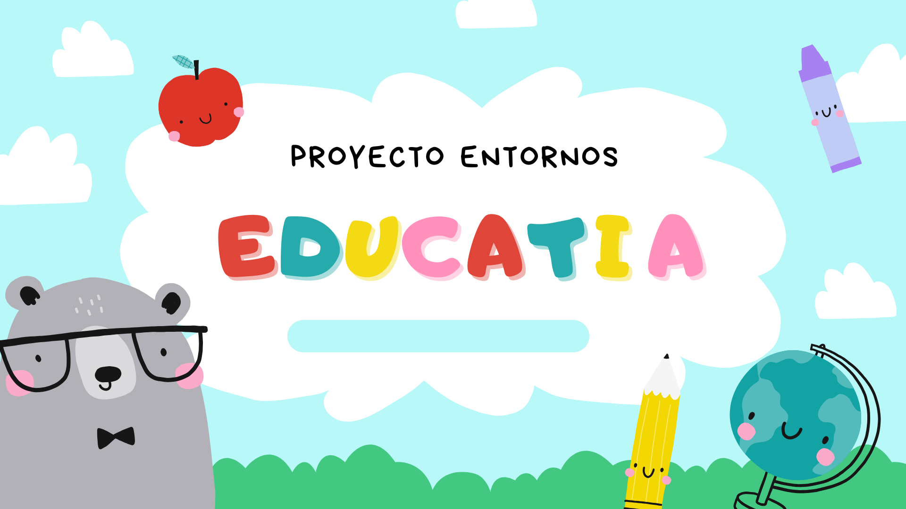

JIRA: https://felineseven9.atlassian.net/jira/software/projects/SCRUM/boards/1/backlog?atlOrigin=eyJpIjoiZGRjMDliNGJkODAxNDA0ZjhlOTgwM2JkNGIxN2VkNWUiLCJwIjoiaiJ9

Este proyecto es una aplicación CRUD desarrollada para la gestión de cursos y sus temas asociados.
Cada curso puede tener múltiples temas, y el sistema permite realizar las operaciones básicas de creación, lectura, actualización y eliminación (Create, Read, Update, Delete) tanto para cursos como para temas.

El sistema implementa autenticación y autorización basada en roles, utilizando JWT (JSON Web Token) para el control de acceso.
Dependiendo del rol asignado al usuario, se definen los permisos sobre las funcionalidades del sistema.

## **Arquitectura y Tecnologías Utilizadas**

**Backend:** Spring Boot (Java)

**Dependencias principales:**

 - Spring Web
 - Spring Data JPA
 - Spring Security
 - JWT (JSON Web Token)
 - MySQL o MariaDB (Base de Datos)

 **Gestión de dependencias:** Maven
 **Pruebas de API:**  Swagger UI / Postman
 
## **Funcionalidades Principales**

### **CRUD de Cursos**
- Crear un nuevo curso  
- Consultar todos los cursos  
- Consultar curso por ID  
- Actualizar datos de un curso  
- Eliminar curso  

### **CRUD de Temas (asociados a cada curso)**
- Crear tema dentro de un curso  
- Listar temas de un curso  
- Consultar tema específico  
- Actualizar tema  
- Eliminar tema  

### **Seguridad con Roles**

El sistema maneja roles de usuario con permisos específicos:

| **Rol**        | **Descripción** | **Permisos** |
|----------------|-----------------|---------------|
| **ADMIN**      | Administrador del sistema | Acceso total a los CRUD de cursos y temas |
| **PROFESOR**   | Creador o editor de cursos | Puede crear y editar cursos y temas |
| **ESTUDIANTE** | Usuario con permisos de lectura | Solo puede visualizar los cursos y temas |

